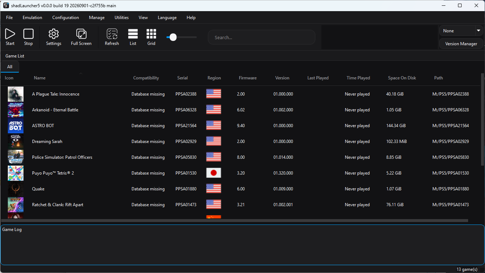
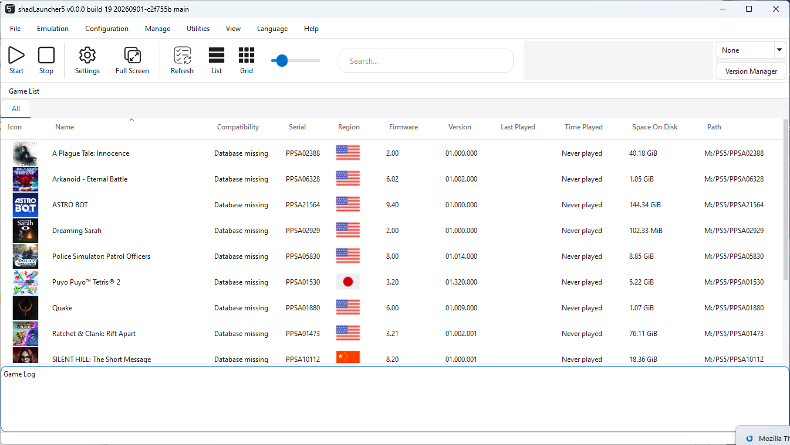
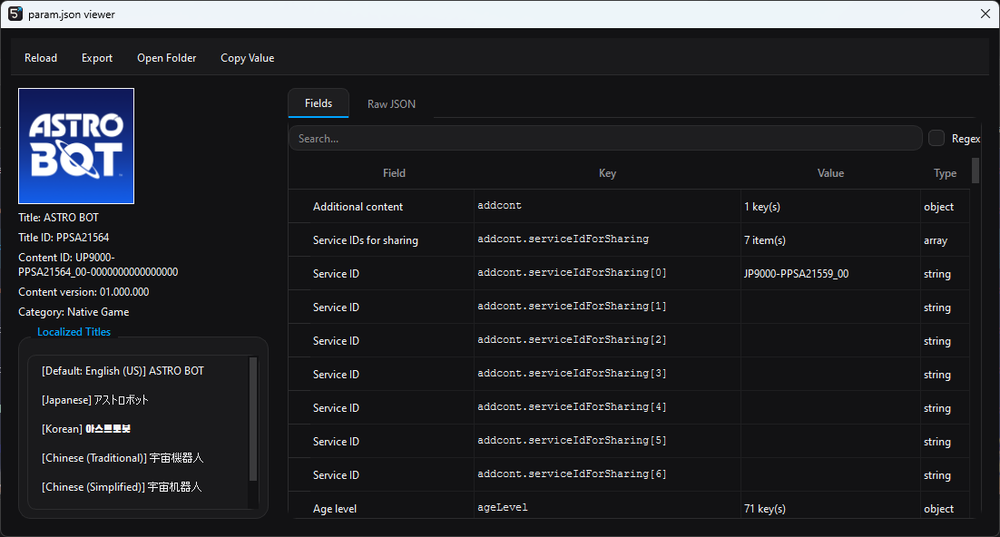
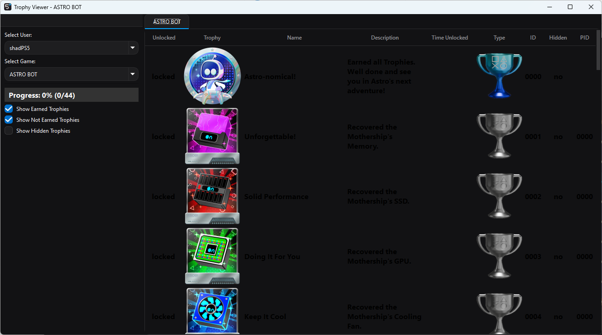

# shadLauncher5
Proof Of Concept Launcher

A Qt-based game launcher for a someday ps5 emulator. shadLauncher5 manages your PS5 game library, tracks metadata and playtime, and launches titles with per-game or global emulator settings — without needing to touch the command line.

<h1 align="center">
 
 <a href="https://shadlaunchers.com">
        
 <a href="https://github.com/shadLaunchers/shadLauncher5/stargazers">
        

</h1>

## Screenshots

<table align="center">
  <tr>
    <td align="center">
      <strong>Game List Dark</strong> 
      
    </td>
    <td align="center">
      <strong>Game List White</strong> 
      
    </td>
  </tr>
  <tr>
    <td align="center">
      <strong>Param.json viewer</strong> 
      
    </td>
    <td align="center">
      <strong>Trophy Viewer</strong> 
      
    </td>
  </tr>
</table>

## Features

### First-time setup

- **Setup Wizard** — guides new users through choosing a UI language and theme, pointing the launcher at their game/addon folders, and picking a emulator version to use. Runs automatically on first launch and can be re-run anytime from **Utilities → Setup Wizard**.

### Game library

- Automatic library scanning from one or more configured game install directories, each independently enabled/disabled.
- **List and Grid** view modes, with four selectable icon sizes (Tiny/Small/Medium/Large).
- Sortable, configurable game list columns.
- Custom **categories** for organizing your library, stored per-game in the local database.
- **Compatibility** status badges (Playable / Ingame / Menus / Boots / etc.) shown inline or in the grid view.
- Search/filter, hidden-entry support (**Hide From Game List**, with a toggle to reveal them again), and a live game-count in the status bar.
- Rename any title in the list without touching the underlying files (**Rename in Game List**), with a one-click **Reset All Custom Titles**.
- **Export Game List** to share or archive your library contents.
- Drag-and-drop friendly, right-click context menu per title.

### Game metadata & tools

- **param.json viewer** — inspect a title's PARAM.JSON (title ID, content ID, supported languages, age ratings, etc.) directly from the context menu.
- **npbind.dat viewer** — inspect a title's NP bind data.
- **Trophy Viewer** — browse a game's trophy list and unlock data.
- Cached name, serial, icon, and install-size metadata for fast list loading, with **Clear Metadata Cache** to force a clean re-read from disk for a single title.
- Playtime and last-played tracking.

### ZArchive (.zar) support

- **Convert to ZArchive** — pack an installed game (or its update) into a compressed `.zar` archive.
- **Browse ZArchive Contents** — inspect a `.zar` archive's contents without extracting it.
- **Extract from ZArchive** — unpack a `.zar` archive back to a normal install directory.

### Multi-version emulator management

- Install and manage multiple emulator versions side by side.
- Pick which installed version launches a given title, independent of the "default" version.
- Update check and download support for new emulator releases.

### File management per title

- Quick-access shortcuts: **Open Game Folder**, **Open Log Folder**.
- **Create Desktop Shortcut** for one-click launching outside the launcher.

### User & save management

- **Manage Users** — switch between or configure multiple emulated user profiles.
- Per-user save data handling, tied into the delete/manage tooling above.

### Settings & customization

- Configurable **GUI** settings: interface language, theme/stylesheet (with support for custom `.qss` themes), icon sizes, list/grid layout, and window behavior.
- **Console Language** — the in-game language games run in is configured independently of the launcher's own UI language, so switching the interface to another language no longer changes what language your games boot in.
- **Paths** configuration: game/addon install directories, save data, screenshots, logs, and more, each independently browsable and editable.
- **Log** configuration with selectable presets for common debugging scenarios.
- Custom stylesheet ("theme") picker, sourced from any `.qss` file found in the searched theme locations.

### Reporting & compatibility feedback

- **Submit Report** / **View Report** — file or review compatibility reports for a title directly from the context menu.
- **Update Database** — refresh the local compatibility/metadata database.

### Housekeeping

- Persistent local cache database (SQLite-backed) for fast game-list loads across sessions.
- About dialog with project/version information and links to shadPS5.

## Building

See `CMakeLists.txt` for the full build configuration and dependency list. shadLauncher5 is built with Qt and CMake alongside the shadPS5 core.

## License

GPL-2.0-or-later. See individual file headers for copyright details.
